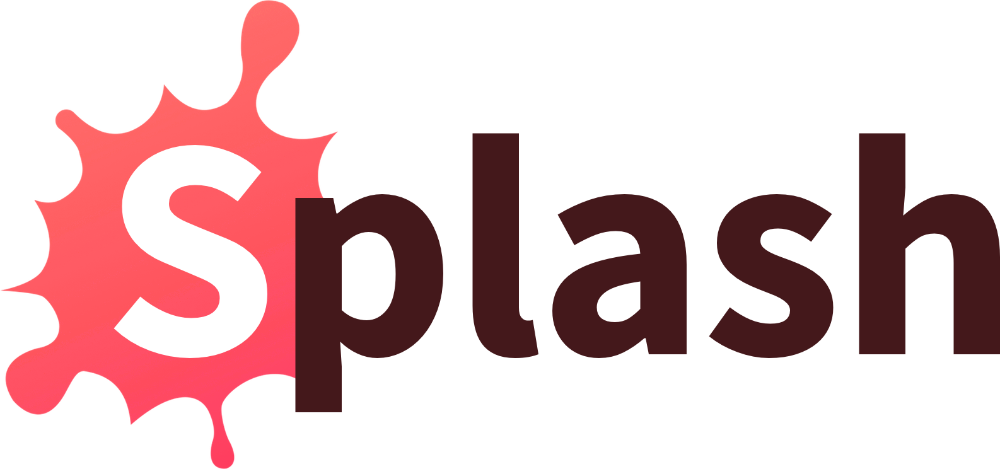
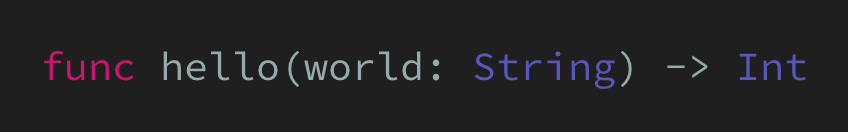

<p align="center">
    
</p>

<p align="center">
    
    <a href="https://swift.org/package-manager">
        
    </a>
     
    <a href="https://twitter.com/johnsundell">
        
    </a>
</p>

Welcome to **Splash** - a fast, lightweight and flexible Swift syntax highlighter. It can be used to generate code sample HTML for a blog post, to turn a string of Swift code into a fully syntax highlighted image, or to build custom developer tools.

It's used to highlight all recent articles on [swiftbysundell.com](https://swiftbysundell.com).

## Usage

Splash can be used either as a library in your own Swift Package Manager-powered tool or script, or by using one of the four built-in command line tools that act as frontends for the Splash library.

### 🌍 On the web

Thanks to my good friend [Gui Rambo](https://twitter.com/_inside), you can [try out Splash directly in your browser](https://splash.rambo.codes)! His web tool lets you use Splash to generate either HTML or an image, by simply pasting Swift code into a text box.

👉 [splash.rambo.codes](https://splash.rambo.codes)

If you're using Jekyll, there's also a custom `````` tag available for the Liquid templating language.

👉 [splashtag](https://github.com/mannberg/splashtag)

### 🖥 On the command line

The easiest way to get started building things with Splash is to use one of the four built-in command line tools that each enable you to use Splash in different ways.

#### SplashHTMLGen

`SplashHTMLGen` uses Splash's HTML output format to generate an HTML string from Swift code. You simply pass it the code you want to highlight as an argument and HTML is returned as standard output.

For example, if you call it like this:

```
$ SplashHTMLGen "func hello(world: String) -> Int"
```

You'll get the following output back:

```html
<span class="keyword">func</span> hello(world: <span class="type">String</span>) -> <span class="type">Int</span>
```

To be as flexible as possible, Splash doesn't hardcode any colors or other CSS attributes in the HTML it generates. Instead it simply assigns a CSS class to each token. For an example of a CSS file that can be used to style Splash-generated HTML, see [Examples/sundellsColors.css](https://github.com/JohnSundell/Splash/blob/master/Examples/sundellsColors.css).

When rendering your outputted html, make sure to wrap your output code in the `<pre>` and `<code>` tags and properly link to your `.css` file. Like this:

```html
<!DOCTYPE html>
<head>
    <title>Hello World</title>
    <link rel="stylesheet" href="sundellsColors.css">
</head>

<pre>
    <code>
        <span class="keyword">func</span> hello(world: <span class="type">String</span>) -> <span class="type">Int</span>
    </code>
</pre>
```

For more information about HTML generation with Splash and how to customize it, see `HTMLOutputFormat` [here](https://github.com/JohnSundell/Splash/blob/master/Sources/Splash/Output/HTMLOutputFormat.swift).

#### SplashMarkdown

`SplashMarkdown` builds on top of `SplashHTMLGen` to enable easy Splash decoration of any Markdown file. Pass it a path to a Markdown file, and it will iterate through all code blocks within that file and convert them into Splash-highlighted HTML.

Just like the HTML generated by `SplashHTMLGen` itself, a CSS file should also be added to any page serving the processed Markdown, since Splash only adds CSS classes to tokens — rather than hardcoding styles inline. See the above `SplashHTMLGen` documentation for more information.

Here’s an example call to decorate a Markdown file at the path `~/Documents/Article.md`:

```
$ SplashMarkdown ~/Documents/Article.md
```

The decorated Markdown will be returned as standard output.

Highlighting can be skipped for any code block by adding `no-highlight` next to the block’s opening row of backticks — like this: *“```no-highlight”*.

#### SplashImageGen

`SplashImageGen` uses Splash to generate an `NSAttributedString` from Swift code, then draws that attributed string into a graphics context to turn it into an image, which is then written to disk.

For example, if you call it like this:

```
$ SplashImageGen "func hello(world: String) -> Int" "MyImage.png"
```

The following image will be generated (and written to disk as `MyImage.png`):



*`SplashImageGen` is currently only available on macOS.*

#### SplashTokenizer

The final built-in command line tool, `SplashTokenizer`, is mostly useful as a debugging tool when working on Splash - but can also be interesting to use in order to see how Splash breaks down code into tokens. Given a string of Swift code, it simply outputs all of its components (excluding whitespaces).

So if you call it like this:

```
$ SplashTokenizer "func hello(world: String) -> Int"
```

You'll get the following standard output back:

```
Keyword token: func
Plain text: hello(world:
Type token: String
Plain text: )
Plain text: ->
Type token: Int
```

### 📦 As a package

To include Splash in your own script or Swift package, [add it as a dependency](#installation) and use the `SyntaxHighlighter` class combined with your output format of choice to highlight a string of code:

```swift
import Splash

let highlighter = SyntaxHighlighter(format: HTMLOutputFormat())
let html = highlighter.highlight("func hello() -> String")
```

Splash ships with two built-in output formats - HTML and `NSAttributedString`, but you can also easily add your own by implementing the `OutputFormat` protocol.

## Installation

Splash is distributed as a Swift package, making it easy to install for use in scripts, developer tools, server-side applications, or to use its built-in command line tools.

Splash supports both macOS and Linux.

*Before you begin, make sure that you have a Swift 4.2-compatible toolchain installed (for example Xcode 10 if you're on a Mac).*

### 📦 As a package

To install Splash for use in a Swift Package Manager-powered tool or server-side application, add Splash as a dependency to your `Package.swift` file. For more information, please see the [Swift Package Manager documentation](https://github.com/apple/swift-package-manager/tree/master/Documentation).

```
.package(url: "https://github.com/JohnSundell/Splash", from: "0.1.0")
```

### 🏃‍♂️ As a Marathon dependency

If you want to use Splash in a [Marathon](https://github.com/johnsundell/marathon) script, either add it to your `Marathonfile` (see the Marathon repo for instructions on how to do that), or point Marathon to Splash using the inline dependency syntax:

```swift
import Splash // https://github.com/johnsundell/splash.git
```

### 🛠 Command line tools

If you want to use Splash through one of its built-in command line tools, start by cloning the repo to your local machine:

```
$ git clone https://github.com/johnsundell/splash.git
$ cd Splash
```

To run a tool without installing it, you can use the Swift Package Manager's `run` command, like this:

```
$ swift run SplashHTMLGen "func hello(world: String) -> Int"
```

To install all four command line tools globally on your system, use Make:

```
$ make install
```

That will install the following four tools in your `/usr/local/bin` folder:

```
SplashHTMLGen
SplashMarkdown
SplashImageGen
SplashTokenizer
```

If you only wish to install one of these, compile it and then move it to `/usr/local/bin`, like this:

```
$ swift build -c release -Xswiftc -static-stdlib
$ install .build/Release/SplashHTMLGen /usr/local/bin/SplashHTMLGen
```

## Contributions and support

Splash is developed completely in the open, and your contributions are more than welcome. It's still a very new project, so I'm sure there are bugs to be found and improvements to be made - and hopefully we can work on those together as a community.

You might notice that this project does not have GitHub issues enabled. That's because with Splash, I'm trying out a new 100% PR-based open source workflow. This is a bit of an experiment, so let's see how it works out.

To read more about suggested workflows when contributing to Splash, how to report bugs and feature requests, as well as technical details and an architectural overview - check out the [Contributing Guide](https://github.com/JohnSundell/Splash/blob/master/CONTRIBUTING.md).

## Hope you enjoy using Splash!

I had a lot of fun building Splash, and I'm looking forward to continue working on it in the open together with you! I hope you'll like it and that you'll find it useful. Let me know what you think on on [Twitter](https://twitter.com/johnsundell) 😊
